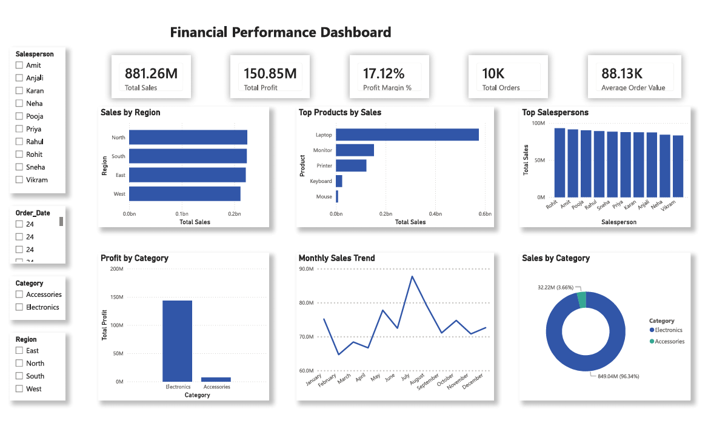
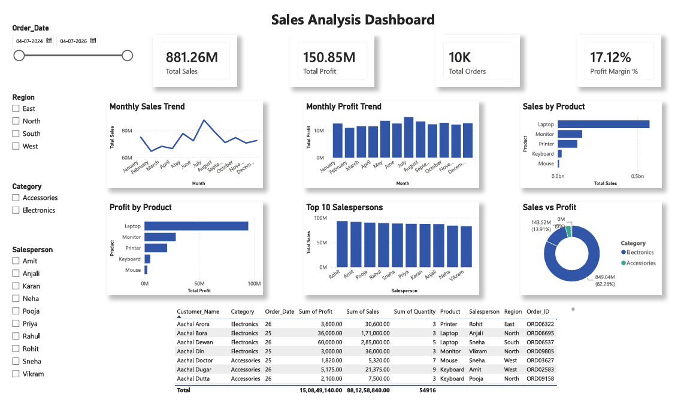

# Financial Performance Analytics Dashboard

## Overview

This project is a Financial Performance Analytics Dashboard built using Power BI, SQL, and Python. The goal was to analyze sales data and create an interactive dashboard that helps understand business performance across different regions, products, categories, and salespersons.

The dashboard provides a clear view of important business metrics such as total sales, profit, profit margin, total orders, and average order value. It also includes interactive filters that allow users to explore the data from different perspectives.

## Tools Used

- Power BI
- SQL
- Python
- Microsoft Excel

## Dashboard Pages

### Executive Dashboard

This page provides a quick summary of overall business performance using KPI cards, sales trends, regional analysis, category-wise sales, product performance, and top salespersons.

### Sales Analysis

This page focuses on detailed sales insights with monthly trends, product performance, salesperson analysis, profit comparison, and a detailed transaction table for deeper analysis.

## Key Metrics

- Total Sales
- Total Profit
- Profit Margin
- Total Orders
- Average Order Value

## Features

- Interactive slicers
- Dynamic KPI cards
- Monthly sales and profit trends
- Regional sales analysis
- Product performance analysis
- Salesperson performance analysis
- Category-wise sales analysis
- Detailed sales records table

## Project Structure

Financial-Performance-Analytics/

├── Dataset/

├── Documentation/

├── Excel/

├── Images/

├── PowerBI/

├── Python/

├── Reports/

├── SQL/

└── README.md

## Dashboard Preview

### Executive Dashboard

### Sales Analysis Dashboard

## What I Learned

While working on this project, I improved my skills in Power BI dashboard design, SQL queries, data cleaning using Python, and creating interactive reports. I also learned how to organize a complete analytics project for GitHub and portfolio purposes.
